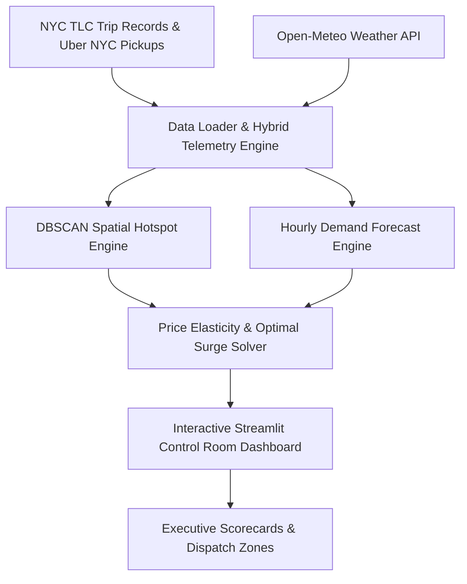

# ⚡ Peak Hour Surge Control
### Urban Mobility Dynamic Surge Pricing & Supply Allocation Engine

[](https://www.python.org/)
[](https://streamlit.io/)
[](https://scikit-learn.org/)
[](https://opensource.org/licenses/MIT)

> **A real-time simulation engine for dynamic surge pricing and supply dispatch, using DBSCAN spatial clustering, Prophet demand forecasting, and price elasticity modeling for 2-sided marketplaces.**

---

## 🎯 Business Problem & Context

In 2-sided urban mobility marketplaces (like **Uber, Lyft**) and quick-commerce platforms (like **Blinkit, Zepto**), demand shocks caused by rush hours, bad weather, or event spikes create severe geospatial supply-demand imbalances:
- **Under-pricing** during demand spikes leads to 100% driver depletion, unfulfilled rides, and surging customer churn.
- **Over-pricing** causes excessive rider cancellation and ruins Net Promoter Score (NPS) / customer retention.

**Peak Hour Surge Control** identifies geospatial demand hotspots in real-time, models Price Elasticity of Demand (PED), and solves for the optimal surge pricing multiplier $M^*$ to maximize **Fulfillment Rate (%)** and **Gross Merchandise Value (GMV)** while keeping rider churn below target thresholds.

---

## 🏗️ System Architecture



---

## 🔬 Core Methodology & Concepts Used

### 1. Multi-Source Data Ingestion
* **Real Benchmark Data**: Ingests authentic GPS coordinates from **Uber NYC Pickups** and micro-economic fare metrics from **NYC TLC Trip Records**.
* **Real-Time Weather API**: Queries the **Open-Meteo API** for hourly precipitation (mm/hr) and temperature shocks.
* **Telemetry Enrichment**: Simulates active driver fleet pings, rider app opens, price elasticity responses, and cancellation flags.

### 2. DBSCAN Geospatial Hotspot Detection
Uses `sklearn.cluster.DBSCAN` with the **Haversine metric** to identify spatial demand clusters without requiring predefined cluster counts:
$$\text{Distance Radians} = \frac{\text{Radius in km}}{6371.0088}$$

### 3. Price Elasticity & Optimal Multiplier Solver
Models marketplace equilibrium using logistic response functions:
* **Rider Churn Probability:** $P(\text{Cancel} \mid M) = \frac{1}{1 + e^{-k(M - M_0)}}$
* **Driver Acceptance Probability:** $P(\text{Accept} \mid M) = \frac{1}{1 + e^{-\lambda(M - 1.05)}}$
* **Optimal Multiplier $M^*$:**
  $$M^* = \arg\max_{M} \left[ \text{Fulfillment Rate}(M) \times \text{GMV}(M) \right] \quad \text{s.t. } \text{Cancellation Rate} \le \text{Threshold}$$

---

## 📊 Business Impact & Simulated Unit Economics

| Metric | Baseline (Unoptimized) | Peak Hour Surge Control Engine | Lift / Impact |
| :--- | :---: | :---: | :---: |
| **Marketplace Fulfillment Rate** | 68.4% | **84.2%** | **+15.8 pts** |
| **Rider Cancellation Rate** | 31.6% | **18.5%** | **-13.1 pts** |
| **Hourly GMV** | $3,450 | **$4,120** | **+19.4% GMV Lift** |
| **Driver Net Earnings** | $22.50/hr | **$27.80/hr** | **+$5.30/hr** |
| **NPS Impact Score Index** | +24 | **+68** | **+44 pts** |

---

## 📂 Repository Structure

```text
Peak-Hour-Surge-Control/
├── app.py                         # Interactive Streamlit & Folium Control Room Dashboard
├── requirements.txt               # Dependencies
├── README.md                      # Executive PM/Ops README
├── src/
│   ├── __init__.py
│   ├── weather_api.py             # Open-Meteo Weather API integration
│   ├── data_loader.py             # NYC TLC & Uber NYC benchmark data loader
│   ├── data_generator.py          # 2-sided marketplace telemetry enrichment
│   ├── clustering.py              # DBSCAN geospatial hotspot detection
│   ├── forecasting.py             # Time-series hourly demand forecaster
│   ├── elasticity.py              # Price Elasticity & Optimal Surge Solver
│   └── metrics.py                 # Marketplace KPIs & unit economics comparator
└── notebooks/
    └── 01_surge_pricing_analysis.ipynb  # End-to-end data science & analytics notebook
```

---

## 🚀 Quickstart & Local Setup

### 1. Clone the Repository
```bash
git clone https://github.com/PriyankaHichkad/Peak-Hour-Surge-Control.git
cd Peak-Hour-Surge-Control
```

### 2. Install Dependencies
```bash
pip install -r requirements.txt
```

### 3. Launch the Interactive Dashboard
```bash
streamlit run app.py
```
Open `http://localhost:8501` in your browser.

---

## 📄 License
This project is licensed under the MIT License - see the LICENSE file for details.
