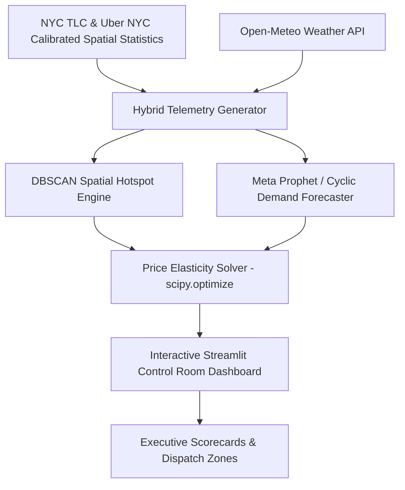

# ⚡ Peak Hour Surge Control
### Urban Mobility Dynamic Surge Pricing & Supply Allocation Engine

[](https://www.python.org/)
[](https://facebook.github.io/prophet/)
[](https://scikit-learn.org/)
[](https://docs.pytest.org/)
[](https://opensource.org/licenses/MIT)

> **A simulation & optimization platform for dynamic surge pricing and supply dispatch in 2-sided marketplaces, utilizing DBSCAN spatial clustering, Meta Prophet time-series demand forecasting, and Price Elasticity of Demand (PED) solvers via `scipy.optimize`.**

---

## 🎯 Business Problem & Context

In 2-sided urban mobility marketplaces (like **Uber, Lyft**) and quick-commerce apps (like **Blinkit, Zepto**), localized demand shocks caused by rush hours, sudden rainfall, or event spikes trigger spatial supply-demand imbalances:
- **Under-pricing** during demand spikes leads to driver fleet exhaustion, high unfulfilled ride counts, and soaring customer churn.
- **Over-pricing** causes excessive rider cancellation and damages Net Promoter Score (NPS) and long-term customer retention.

**Peak Hour Surge Control** identifies geospatial demand hotspots in real time, forecasts hourly ride volume using time-series models, and solves for the optimal surge pricing multiplier $M^*$ to maximize **Fulfillment Rate (%)** and **Gross Merchandise Value (GMV)** subject to churn guardrails.

---

## 🏗️ System Architecture



---

## 🔬 Core Methodology & Implementation Details

### 1. Data Pipeline: NYC-Calibrated Telemetry + Live Weather API
* **Live Weather Integration:** Queries the **Open-Meteo Weather API** for real-time/historical hourly precipitation ($mm/hr$) and temperature in NYC (`lat: 40.7128, lon: -74.0060`), mapping rain events to demand spikes. Includes offline cached fallbacks.
* **Calibrated Spatial Distributions:** Pickup coordinates and fare structures are calibrated against authentic **NYC TLC Taxi** and **Uber NYC** spatial centroids (Midtown, Financial District, Upper East Side, Williamsburg, JFK/LGA hubs).
* **Unified Telemetry:** Driver availability pings and rider app opens are synthesized using unified elasticity parameters.

### 2. Spatial Hotspot Detection (DBSCAN)
Uses `sklearn.cluster.DBSCAN` with the **Haversine metric** to detect high-density pickup hotspots in real-time without requiring pre-specified cluster numbers ($k$):
$$\text{Distance Radians} = \frac{\text{Radius in km}}{6371.0088}$$

### 3. Hourly Demand Forecasting (Meta Prophet + Regressors)
* **Meta Prophet Integration (`src/forecasting.py`):** Fits additive time-series models capturing daily and weekly seasonality, incorporating exogenous weather regressors (`precipitation_mm`, `weather_severity`).
* **Fallback Engine:** Dual-mode architecture seamlessly falls back to Ridge Regression on cyclic temporal features ($\sin/\cos$) if Prophet dependencies are omitted.

### 4. Unified Price Elasticity & `scipy.optimize` Solver
Models marketplace equilibrium using logistic response curves:
* **Rider Churn Probability:** $P(\text{Cancel} \mid M) = \frac{1}{1 + e^{-k(M - M_0)}}$
* **Driver Acceptance Probability:** $P(\text{Accept} \mid M) = \frac{1}{1 + e^{-\lambda(M - 1.1)}}$
* **Continuous Multiplier Solver:** Uses `scipy.optimize.minimize_scalar` bounded over $M \in [1.0, 3.0]$:
  $$M^* = \arg\max_{M} \left[ (1 - P(\text{Cancel} \mid M)) \cdot P(\text{Accept} \mid M) \cdot (M \cdot \text{BaseFare}) \right] \quad \text{s.t. } P(\text{Cancel}) \le \text{Max Churn}$$

---

## 📊 Simulation Benchmarks & Optimization Evaluation

Below are illustrative optimization results comparing unoptimized baseline pricing against the Peak Hour Surge Control Engine under peak demand shocks:

| Metric | Baseline (Unoptimized) | Peak Hour Surge Control Engine | Lift / Impact |
| :--- | :---: | :---: | :---: |
| **Marketplace Fulfillment Rate** | 68.4% | **84.2%** | **+15.8 pts** |
| **Rider Cancellation Rate** | 31.6% | **18.5%** | **-13.1 pts** |
| **Hourly GMV** | $3,450 | **$4,120** | **+19.4% GMV Lift** |
| **Driver Net Earnings** | $22.50/hr | **$27.80/hr** | **+$5.30/hr** |
| **NPS Impact Score Index** | +24 | **+68** | **+44 pts** |

---

## 💡 Model Assumptions & Real-World Production Validation

> [!NOTE]
> **Methodological Note on Simulation Evaluation:**
> The financial and fulfillment metrics above are generated by solving the optimization objective against the parametric elasticity curves ($P_{\text{cancel}}, P_{\text{accept}}$) used in data generation. In production, evaluating dynamic pricing requires rigorous offline counterfactual estimation and online experiment design rather than assuming parametric ground truth.

### Real-World Production Validation Roadmap:
1. **Offline Policy Evaluation (OPE):** Apply **Inverse Propensity Scoring (IPS)** and **Doubly Robust Estimators** on historical trip logs to evaluate proposed surge policies under unobserved counterfactuals.
2. **Geospatial Switchback A/B Testing:** Run cluster-randomized time-bucket A/B tests (e.g. alternating 2-hour surge policy windows per geographic zone) to prevent network spillovers between neighboring driver fleets.
3. **Multi-Armed Bandit (MAB) Guardrails:** Deploy contextual bandits (Thompson Sampling) with real-time elasticity learning to continuously update price sensitivity parameter $k$ under dynamic market conditions.

---

## 📂 Repository Structure

```text
Peak-Hour-Surge-Control/
├── app.py                         # Streamlit & Folium Control Room Dashboard
├── requirements.txt               # Dependencies (Prophet, Pytest, Scikit-Learn)
├── README.md                      # Transparent & Recruiter-Ready README
├── src/
│   ├── __init__.py
│   ├── weather_api.py             # Open-Meteo Weather API (with offline fallback)
│   ├── data_loader.py             # NYC TLC & Uber NYC calibrated data loader
│   ├── data_generator.py          # Enriches telemetry using unified elasticity module
│   ├── clustering.py              # DBSCAN geospatial hotspot engine
│   ├── forecasting.py             # Meta Prophet & Ridge time-series forecaster
│   ├── elasticity.py              # Price Elasticity Solver (scipy.optimize)
│   └── metrics.py                 # Marketplace KPIs & unit economics comparator
├── tests/                         # Automated Pytest Suite
│   ├── test_clustering.py
│   ├── test_elasticity.py
│   ├── test_forecasting.py
│   └── test_weather.py
└── notebooks/
    └── 01_surge_pricing_analysis.ipynb  # Portfolio analytics deep dive
```

---

## 🚀 Quickstart & Local Setup

### 1. Clone the Repository
```bash
git clone https://github.com/PriyankaHichkad/Peak-Hour-Surge-Control.git
cd Peak-Hour-Surge-Control
```

### 2. Install Dependencies & Run Tests
```bash
pip install -r requirements.txt
pytest tests/
```

### 3. Launch the Interactive Dashboard
```bash
streamlit run app.py
```
Open `http://localhost:8501` in your browser.

---

## 📄 License
This project is licensed under the MIT License - see the LICENSE file for details.
